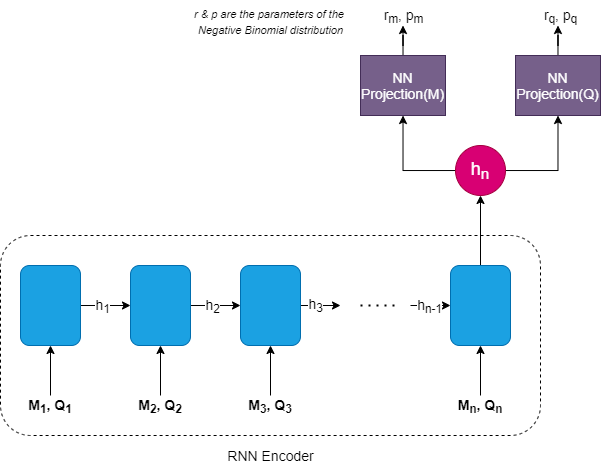

# GluonTS Implementation of Deep Renewal Processes
[](https://pypi.python.org/pypi/deeprenewal)
[](https://travis-ci.com/manujosephv/deeprenewalprocess)
[](https://deeprenewalprocess.readthedocs.io/en/latest/?badge=latest)

[](https://github.com/manujosephv/deeprenewalprocess/issues)
[](http://hits.dwyl.com/manujosephv/deeprenewalprocess)
<!-- [](https://colab.research.google.com/github/Zhenye-Na/DA-RNN/blob/master/src/da_rnn.ipynb.py) -->


> Intermittent Demand Forecasting with Deep Renewal Processes
> Ali Caner Turkmen, Yuyang Wang, Tim Januschowski

## Installation

*Recommended Python Version*: 3.6

```
 pip install deeprenewal
```

If you are working Windows and need to use your GPU(which I recommend), you need to first install MXNet==1.6.0 version which supports GPU
[MXNet Official Installation Page](https://mxnet.apache.org/versions/1.6.0/get_started?platform=windows&language=python&processor=gpu&environ=pip&)

And if you are facing difficulties installing the GPU version, you can try(depending on the CUDA version you have)

```
pip install mxnet-cu101==1.6.0 -f https://dist.mxnet.io/python/all
```

[Relevant Github Issue](https://github.com/apache/incubator-mxnet/issues/17719)


The sources for DeepRenewal can be downloaded from the `Github repo`_.

You can either clone the public repository:

```
git clone git://github.com/manujosephv/deeprenewal
```

Once you have a copy of the source, you can install it with:

```
python setup.py install
```

## Model


## Usage

### Train with CLI

```
usage: deeprenewal [-h] [--use-cuda USE_CUDA] 
                   [--datasource {retail_dataset}]
                   [--regenerate-datasource REGENERATE_DATASOURCE]
                   [--model-save-dir MODEL_SAVE_DIR]
                   [--point-forecast {median,mean}]
                   [--calculate-spec CALCULATE_SPEC] 
                   [--batch_size BATCH_SIZE]
                   [--learning-rate LEARNING_RATE] 
                   [--max-epochs MAX_EPOCHS]
                   [--number-of-batches-per-epoch NUMBER_OF_BATCHES_PER_EPOCH]
                   [--clip-gradient CLIP_GRADIENT]
                   [--weight-decay WEIGHT_DECAY]
                   [--context-length-multiplier CONTEXT_LENGTH_MULTIPLIER]
                   [--num-layers NUM_LAYERS] 
                   [--num-cells NUM_CELLS]
                   [--cell-type CELL_TYPE] 
                   [--dropout-rate DROPOUT_RATE]
                   [--use-feat-dynamic-real USE_FEAT_DYNAMIC_REAL]
                   [--use-feat-static-cat USE_FEAT_STATIC_CAT]
                   [--use-feat-static-real USE_FEAT_STATIC_REAL]
                   [--scaling SCALING]
                   [--num-parallel-samples NUM_PARALLEL_SAMPLES]
                   [--num-lags NUM_LAGS] 
                   [--forecast-type FORECAST_TYPE]

GluonTS implementation of paper 'Intermittent Demand Forecasting with Deep
Renewal Processes'

optional arguments:
  -h, --help            show this help message and exit
  --use-cuda USE_CUDA
  --datasource {retail_dataset}
  --regenerate-datasource REGENERATE_DATASOURCE
                        Whether to discard locally saved dataset and
                        regenerate from source
  --model-save-dir MODEL_SAVE_DIR
                        Folder to save models
  --point-forecast {median,mean}
                        How to estimate point forecast? Mean or Median
  --calculate-spec CALCULATE_SPEC
                        Whether to calculate SPEC. It is computationally
                        expensive and therefore False by default
  --batch_size BATCH_SIZE
  --learning-rate LEARNING_RATE
  --max-epochs MAX_EPOCHS
  --number-of-batches-per-epoch NUMBER_OF_BATCHES_PER_EPOCH
  --clip-gradient CLIP_GRADIENT
  --weight-decay WEIGHT_DECAY
  --context-length-multiplier CONTEXT_LENGTH_MULTIPLIER
                        If context multipler is 2, context available to hte
                        RNN is 2*prediction length
  --num-layers NUM_LAYERS
  --num-cells NUM_CELLS
  --cell-type CELL_TYPE
  --dropout-rate DROPOUT_RATE
  --use-feat-dynamic-real USE_FEAT_DYNAMIC_REAL
  --use-feat-static-cat USE_FEAT_STATIC_CAT
  --use-feat-static-real USE_FEAT_STATIC_REAL
  --scaling SCALING     Whether to scale targets or not
  --num-parallel-samples NUM_PARALLEL_SAMPLES
  --num-lags NUM_LAGS   Number of lags to be included as feature
  --forecast-type FORECAST_TYPE
                        Defines how the forecast is decoded. For details look
                        at the documentation
```

An example of training process is as follows:

```
python3 deeprenewal --datasource retail_dataset --lr 0.001 --epochs 50
```
### Train with Jupyter Notebook

```python
dataset = get_dataset(args.datasource, regenerate=False)
prediction_length = dataset.metadata.prediction_length
freq = dataset.metadata.freq
cardinality = ast.literal_eval(dataset.metadata.feat_static_cat[0].cardinality)
train_ds = dataset.train
test_ds = dataset.test
trainer = Trainer(ctx=mx.context.gpu() if is_gpu&args.use_cuda else mx.context.cpu(), 
                  batch_size=args.batch_size,
                  learning_rate=args.learning_rate,
                  epochs=20,
                  num_batches_per_epoch=args.number_of_batches_per_epoch,
                  clip_gradient=args.clip_gradient,
                  weight_decay=args.weight_decay,
                  hybridize=True) #hybridize false for development
 
estimator = DeepRenewalEstimator(
    prediction_length=prediction_length,
    context_length=prediction_length*args.context_length_multiplier,
    num_layers=args.num_layers,
    num_cells=args.num_cells,
    cell_type=args.cell_type,
    dropout_rate=args.dropout_rate,
    scaling=True,
    lags_seq=np.arange(1,args.num_lags+1).tolist(),
    freq=freq,
    use_feat_dynamic_real=args.use_feat_dynamic_real,
    use_feat_static_cat=args.use_feat_static_cat,
    use_feat_static_real=args.use_feat_static_real,
    cardinality=cardinality if args.use_feat_static_cat else None,
    trainer=trainer,
)
predictor = estimator.train(train_ds, test_ds)
deep_renewal_flat_forecast_it, ts_it = make_evaluation_predictions(
    dataset=test_ds, predictor=predictor, num_samples=100
)
evaluator = IntermittentEvaluator(quantiles=[0.25,0.5,0.75], median=True, calculate_spec=False, round_integer=True)
#DeepAR
agg_metrics, item_metrics = evaluator(
    ts_it, deep_renewal_flat_forecast_it, num_series=len(test_ds)
)
```
Check out the examples folder for notebooks


## References

[1] Ali Caner Turkmen, Yuyang Wang, Tim Januschowski. [*"Intermittent Demand Forecasting with Deep Renewal Processes"*](https://arxiv.org/pdf/1911.10416.pdf). arXiv:1911.10416 [cs.LG] (2019)
[2] Alexander Alexandrov, Konstantinos Benidis, Michael Bohlke-Schneider, Valentin Flunkert, Jan Gasthaus, Tim Januschowski, Danielle C. Maddix, Syama Rangapuram, David Salinas, Jasper Schulz, Lorenzo Stella, Ali Caner Türkmen, Yuyang Wang;. [*"GluonTS: Probabilistic and Neural Time Series Modeling in Python"*](https://www.jmlr.org/papers/v21/19-820.html). (2020).